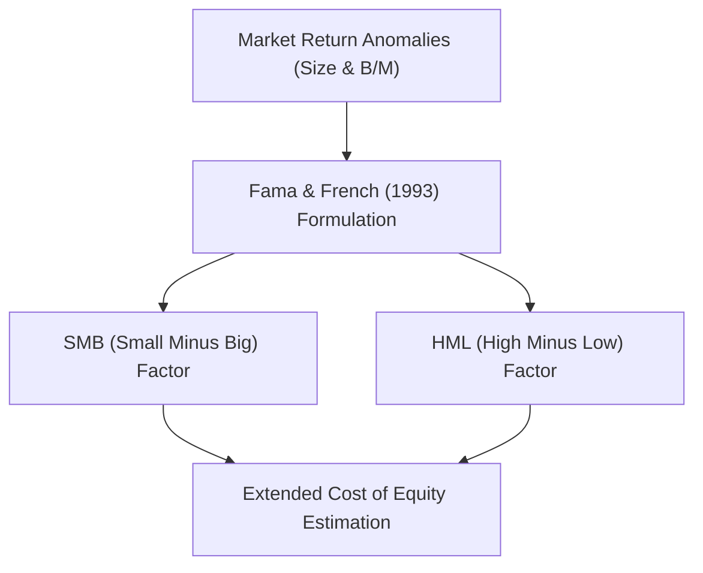

# CHALK — COMPETITIVE BENCHMARK & ARCHITECTURAL ROADMAP
*Document Version: 1.0.0 — Phase 4 Engineering Review*

---

## EXECUTIVE SUMMARY

Chalk is engineered with a strict design philosophy: **"Let them talk. Chalk does the work."**
It operates as a zero-overhead, background desktop daemon that captures 3.5h to 7h university lectures, synchronizes spoken explanations with visual slide transitions, and synthesizes structured LaTeX Markdown without routing private student data through intermediary cloud services.

This document presents a rigorous comparative architectural audit against existing desktop and meeting AI tools, followed by technical implementation blueprints for the next four major engineering horizons.

---

## 1. COMPETITIVE AUDIT & ARCHITECTURAL BENCHMARK

| Feature / Dimension | **Chalk (Current)** | **Granola** | **Screenpipe** | **Whisper.cpp** | **Otter.ai** |
| :--- | :--- | :--- | :--- | :--- | :--- |
| **Privacy & Architecture** | **True Zero-Knowledge BYOK** (Client $\to$ Google AI Studio direct) | Proprietary Cloud Proxy (Uploads audio to remote servers) | 100% Local (SQLite & raw chunks) | 100% Local (CPU / Metal) | Centralized SaaS (Cloud storage, audio training) |
| **Credential Security** | **Native OS Keyring** (macOS Keychain / Windows DPAPI) | Account login / Auth0 token | N/A (Local models) | N/A (Local models) | Cloud session cookie |
| **Multimodal Vision** | **Perceptual Hash (pHash)** slide transition trigger ($\Delta > 10$) | None (Audio only) | Continuous screen OCR (Heavy OCR loop) | None | Slide capture via Zoom bot integration only |
| **Audio Routing** | **Dual-Channel Synchronized** (Mic + System Loopback) | Mic or System (Virtual driver) | System loopback + Mic into raw files | Single audio input buffer | Virtual meeting bot attendee |
| **Academic Note Synthesis** | **Native LaTeX Proofs & KaTeX** ($\nabla \times \mathbf{E}$, CAPM, etc.) | Executive bullet points & business summaries | Raw unformatted OCR & transcript index | Raw transcript text (no synthesis) | Flat transcripts with speaker diarization |
| **Context Window** | **1,000,000 Tokens** (Gemini 2.5 Flash long-context) | Small-context LLM (OpenAI / Anthropic via proxy) | Local embedding search (Chunk RAG) | Limited to audio buffer length | Traditional rolling chunk window |
| **Disk & Resource Cost** | **Minimal** (Compressed Opus / WAV + Delta slide hashes) | Cloud stored | Very Heavy (10–25 GB / day SQLite & video) | Low CPU/GPU RAM footprint | Cloud stored |
| **Austrian / EU Compliance** | **Zero-Cookie, DSGVO § 25 MedienG & § 120 StGB notice** | US SaaS standard TOS | Open source local | Open source local | US Cloud SaaS |

### Critical Takeaways
1. **Granola & Otter** are tailored for 30-minute corporate standups, failing in rigorous STEM lectures where mathematical derivations, equation proofs, and slide visual context are paramount.
2. **Screenpipe** achieves locality at the cost of catastrophic disk saturation (capturing full-frame screen video continuously), whereas Chalk captures slides purely on semantic perceptual transitions.
3. **Whisper.cpp** excels at raw phoneme decoding but lacks vision awareness, hierarchical synthesis, and formatting.

---

## 2. TECHNICAL IMPLEMENTATION BLUEPRINTS

```
                                      CHALK FUTURE ARCHITECTURE
                                     
   +------------------------------------------------------------------------------------------+
   |                                     INPUT CAPTURE                                        |
   |   [Dual-Channel Audio: Mic + System Loopback]          [pHash Screen Slide Watcher]      |
   +------------------------------------+---------------------------------+-------------------+
                                        |                                 |
                                        v                                 v
   +------------------------------------------------------------------------------------------+
   |                                   INTELLIGENT ROUTER                                     |
   |              [Online: Gemini 2.5 Flash (1M Tok)]  <-->  [Offline: MLX / Whisper.cpp]     |
   +------------------------------------+---------------------------------+-------------------+
                                        |
                                        v
   +------------------------------------------------------------------------------------------+
   |                                    SYNTHESIS ENGINE                                      |
   |       - LaTeX Proof Extraction            - Mermaid.js Diagrams                          |
   |       - Wikilink Graph Construction       - Flashcard Generation                         |
   +------------------------------------+---------------------------------+-------------------+
                                        |
                   +--------------------+--------------------+
                   v                                         v
   +-------------------------------+       +--------------------------------------------------+
   |      OBSIDIAN VAULT SINK      |       |             ANKICONNECT HTTP SINK                |
   |   - [[Wikilinks]] Graph       |       |   - JSON-RPC 2.0 to localhost:8765               |
   |   - chalk-audio:// URI scrub  |       |   - Cloze deletion & Equation cards              |
   +-------------------------------+       +--------------------------------------------------+
```

---

### BLUEPRINT 1: LOCAL MLX / WHISPER.CPP OFFLINE HYBRID FALLBACK

#### Objective
Enable Chalk to operate completely offline when campus Wi-Fi drops or Google AI Studio encounters transient 429 rate limits, with seamless background reconciliation upon reconnection.

#### Component Architecture
1. **Engine Selection:**
   - **macOS (Apple Silicon):** `mlx-whisper` running quantized `whisper-large-v3-turbo` via Metal unified memory ($\sim 1.6 \text{ GB}$ VRAM, $12\times$ real-time factor).
   - **Windows / Linux:** `whisper.cpp` shared library bindings with AVX2/CUDA backend.
2. **Failover State Machine:**
```python
class HybridTranscriptionRouter:
    def __init__(self, primary_client, fallback_engine):
        self.primary = primary_client
        self.fallback = fallback_engine
        self.offline_queue = []

    def transcribe(self, audio_chunk, visual_frames):
        if self.is_network_available() and self.primary.check_quota():
            try:
                return self.primary.synthesize(audio_chunk, visual_frames)
            except NetworkException:
                pass
        
        # Local Fallback
        local_transcript = self.fallback.transcribe(audio_chunk)
        self.offline_queue.append({
            "timestamp": time.time(),
            "transcript": local_transcript,
            "frames": visual_frames
        })
        return f"[OFFLINE SYNTHESIS]: {local_transcript}"
```

---

### BLUEPRINT 2: OBSIDIAN VAULT BI-DIRECTIONAL LINKING & MERMAID.JS

#### Objective
Transform unstructured lecture syntheses into an interactive knowledge graph natively understood by Obsidian, Logseq, and Foam.

#### Implementation Schema
1. **Frontmatter YAML Generation:**
```yaml
---
title: "FIN-402: Multi-Factor Capital Asset Pricing"
date: 2026-10-06 14:00
course: "Advanced Finance"
lecturer: "Univ.-Prof. Dr. Weber"
tags: [lecture, finance, asset-pricing, capm]
chalk_session_id: "chk_9f81a7d2"
---
```
2. **Wikilink Extraction:**
   The prompt instructs Gemini 2.5 Flash to wrap all domain entities, foundational theorems, and referenced formulas in double brackets:
   - Example: `The derivation expands upon [[Fama-French Three-Factor Model]] by adding [[Momentum Factor (Carhart 1997)]].`
3. **Automated Mermaid Diagram Generation:**
   Complex processes (e.g. proof sequences, algorithm control flows, historical causal timelines) are automatically cast into fenced `mermaid` blocks:


---

### BLUEPRINT 3: `chalk-audio://` DEEP-LINKING AUDIO SCRUB PROTOCOL

#### Objective
Allow users reviewing notes in Obsidian or VS Code to click a timestamp link (e.g., `[01:38:12]`) and immediately scrub the Chalk daemon or local audio player to that exact millisecond.

#### Protocol Specification
- **URI Pattern:** `chalk-audio://play?session=<SESSION_ID>&ms=<MILLISECONDS>`
- **macOS Registration (`Info.plist`):**
```xml
<key>CFBundleURLTypes</key>
<array>
    <dict>
        <key>CFBundleURLName</key>
        <string>run.chalk.audio</string>
        <key>CFBundleURLSchemes</key>
        <array>
            <string>chalk-audio</string>
        </array>
    </dict>
</array>
```
- **Windows Registration (Registry):**
```text
[HKEY_CLASSES_ROOT\chalk-audio]
@="URL:Chalk Audio Scrub Protocol"
"URL Protocol"=""

[HKEY_CLASSES_ROOT\chalk-audio\shell\open\command]
@="\"C:\\Program Files\\Chalk\\Chalk.exe\" --handle-uri \"%1\""
```
- **Runtime Handling:**
The running daemon listens via a local UNIX domain socket or named pipe. When `chalk-audio://play?session=chk_9f81&ms=5892000` is invoked, the daemon brings the Floating HUD to the foreground, opens the waveform player, and seeks to `01:38:12`.

---

### BLUEPRINT 4: ANKICONNECT HTTP AUTO-SYNC (`localhost:8765`)

#### Objective
Generate high-retention spaced repetition flashcards from lecture formulas, definitions, and oral exam warnings, syncing directly into the user's running Anki instance without manual export/import.

#### JSON-RPC 2.0 Integration
Chalk connects to Anki via the AnkiConnect plugin on `http://127.0.0.1:8765`:

```python
import json
import urllib.request

def sync_card_to_anki(deck_name: str, front_latex: str, back_explanation: str):
    payload = {
        "action": "addNote",
        "version": 6,
        "params": {
            "note": {
                "deckName": f"Chalk::{deck_name}",
                "modelName": "Basic",
                "fields": {
                    "Front": front_latex,
                    "Back": back_explanation
                },
                "options": {
                    "allowDuplicate": False,
                    "duplicateScope": "deck"
                },
                "tags": ["chalk-auto-sync", "lecture-active"]
            }
        }
    }
    
    req = urllib.request.Request(
        "http://127.0.0.1:8765",
        data=json.dumps(payload).encode("utf-8"),
        headers={"Content-Type": "application/json"}
    )
    with urllib.request.urlopen(req, timeout=1.5) as resp:
        return json.loads(resp.read().decode("utf-8"))
```

#### Heuristic Card Extraction Filter:
Flashcards are generated specifically when:
1. The instructor explicitly states: *"This will be tested"*, *"Notice the difference between X and Y"*, or *"Common mistake in the exam"*.
2. A formal mathematical definition is proven on a slide.
3. An acronym or specific terminology is defined.

---

## 3. SUMMARY MILESTONE SCHEDULE

- **Sprint 4.1 (Current):** Brand Monochrome Identity, Crazy Animated Web Showcase, Checksum Verification.
- **Sprint 5.0:** Obsidian Vault auto-exporter (`.obsidian` plugin / dynamic markdown sink).
- **Sprint 5.1:** `chalk-audio://` OS scheme handler & waveform micro-player in HUD.
- **Sprint 5.2:** AnkiConnect JSON-RPC sync daemon.
- **Sprint 6.0:** Local Apple Silicon MLX / Whisper.cpp offline hybrid failover.
